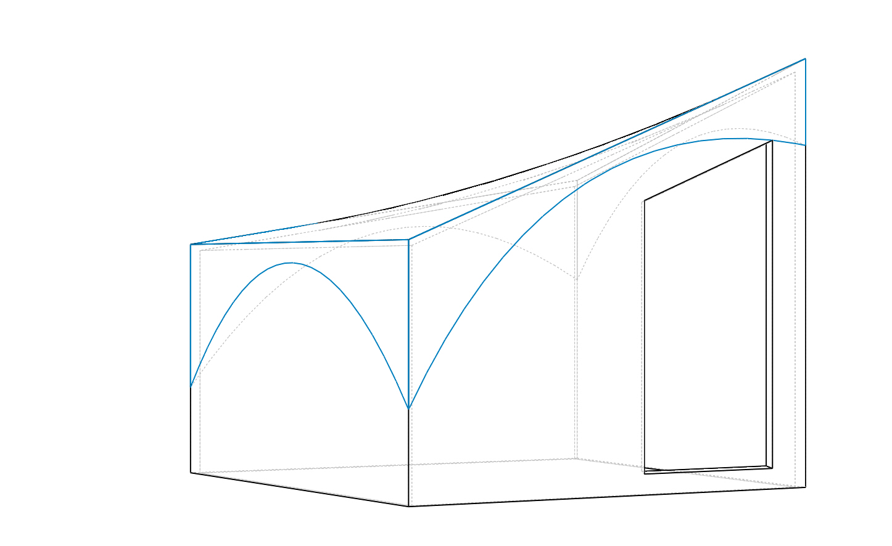

# HyparHuts - Temporary Structures

HyparHuts are temporary shelters for most environments that setup in under 5 minutes.
They are infinitely customizable and fold flat for storage and transport.
HyparHuts were originally inspired by the good work from the Hexayurt community but created specifically to address many problems that have emerged.

## Theory

At the core, HyparHuts are based off of the same rigid insulation foam that is used to make most Hexayurts.
The main difference is the absence of any tape to form the hinges.
Instead, we’ve developed techniques using other materials to augment the bare rigid insulation foam, making the structures far more durable.
We’ve also developed a new general shape that enables the entire structed to be hinged together enabling nearly instant setup.

## House Wrap

The main structural addition is to tightly wrap each panel of insulation with house wrap, attached with contact cement, before assembling the panels into a whole structure.
Tyvek is the name brand house wrap that most are familiar with.
The house wrap is an excellent substrate for making strong hinges, is a liquid barrier, provides a puncture resistant layer, is a container for any potential loose debris, and hides any intentional or unintentional features or blemishes.

## Hinges

In order to form strong hinges, any load that we want to counter needs to be transferred into shear forces on the glue joints.
As long as the glues joints can never be pulled in a direction that peels, they last effectively forever.
First, to ensure that our base wrap does not fail, it is critical that the panels we’re wrapping are convex near the hinges.
To keep the hinges themselves in sheer, multiple strips need to be crossed at the joint and wrap tightly around edges.
This is commonly called a fabric hinge.

## Reinforcements for Durability

One of the most important things for longevity that is hidden under the wrap is wooden trim around the perimeter of each panel.
This provides an impact resistant layer on each edge of the foam board which is the part that is most easily damage in transport.
This also helps provide a stronger base for the hinges which helps remove any sloppiness in the joint enables very defined movement.
We can also use thicker trim for the bottom edges as those will take the harshest impacts.
With a thicker piece of wood on the bottom, it is trivial to screw on extra rubber feet to take the load when sliding the huts around during transport.

## Optional Additions

It is also possible to join multiple bare insulation boards into one panel before wrapping, enabling large walls.
It is possible to hide structural reinforcements for, for instance, an AC unit, a clothing rod, or a swamp cooler.
LED strips are also thin enough that they could easily be stuck to the insulation foam before the initial wrapping and can easily shine through the white house wrap.
The foam board is thick enough to include a pocket for a rechargeable battery.
A solar panel could be built-into the outside layer enabling automatic deployment of an entire power system with interior and exterior lights with built-in switches and other accessories.

## Frame

Arguably, one of the most annoying and time intensive parts of the setup for temporary structures is staking the structure to the ground and tying ropes.
Instead of doing this part last, we recommend building a separate frame to sit on the ground and staking it to the ground first.
This frame provides a level base for the hut to sit on and could include a ground cover and puddle barrier.
It is also far easier to stake bare frames to the ground without the worry of damaging the delicate foam board with a large hammer.
Once the frame is in place, it is designed with notches that match up to the feet used for sliding around the warehouse.
This provides nice positive lateral engagement between the frame and structure.

## Roof

To tie the whole structure together, we’ve designed a roof tarp that fits snugly over the entire structure.
The tarp includes bungies to hold the tarp to the frame simplifying setup and tensioning the entire roof to help prevent fluttering in the wind.
The tarp also provides the main waterproofing layer and holds the walls in which holds the roof panels in place.
A nice added benefit is that there are no guy wires, removing any tripping hazards.

## Hypar Huts

HyparHuts get their name from one key design feature.
It may not be immediately obvious, but the roof is intentionally twisted.
This twist is intended to approximate a hyperbolic paraboloid, or hypar for short.
Long story short, this helps to tension the roof panels which helps keep the entire structure rigid in the wind.

## Designs

There are many different ways of connecting rigid foam boards into larger structures.
The Hexayurt community has explored a large variety of possible shapes.
While the HyparHut building techniques are fully applicable to other shapes, we’ll be focusing on one new one that is optimal in certain ways.

## Folding Pattern

The preferred folding pattern is similar to an accordion.
Because of this, picking where the side walls fold is not the seemingly obvious midpoint, but actually slightly off center so that when folded flat, all of the edges meet correcty.

It is also possible to use a "zig-zag" pattern and reversing the hinges to make the walls "unwrap".
This makes the setup take a little longer but enables different packing configurations that might be desierable.

## Purchase List

This is an old list. The prices and quantities are not all accurate.

 - 4'x8'x1.5" R-Max Foam Board - 10 @ $27.25
 - Contact Cement - 4~5 gal @ $30/gal or $40 for non-flammable
 - Home Wrap - ~75' @ $159/150' for TYVEK or $89/150' for off brand
 - Wood Trim - 1 sheet plywood @ ~$20
 - Optional Frame - $30-$40
 - Roof tarp - $11-$20
 - Conservative Grand Total: $582

## Versions

 - V1 - Shown at Maker Faire. Been to the playa 4 years running.
 - V2 - "zig-zag" folded version. (Missing design files :( )
 - V3 - The current iteration. A little taller. Thinner when folded.

## Files

 - [Layout.sldprt](Layout.sldprt) - The most recent itteration. Single part, all sketches. Parameterized to help visualize and change values.
 - [Layout.sldasm](Layout.sldasm) - Old generation assembly of hut and roof tarp.
 - [Part2.SLDPRT](Part2.SLDPRT) - Simple sketch to calculate correct length to cut edging.

